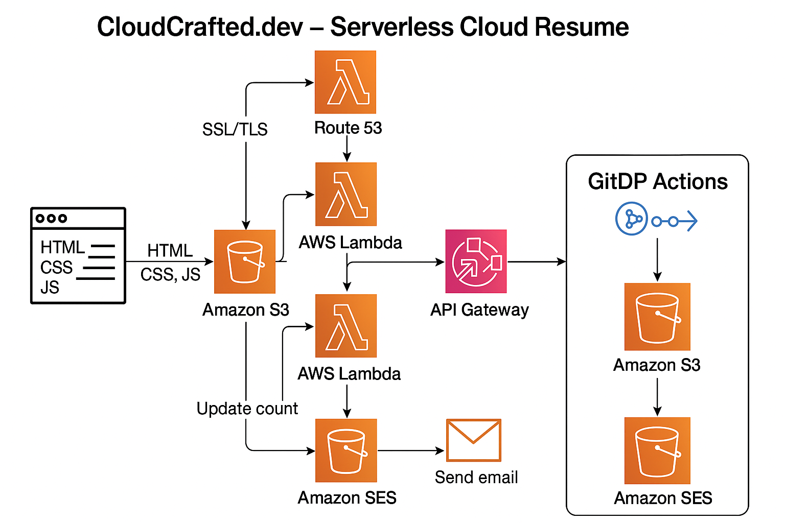

# 🌩️ Cloud Resume Challenge — Brad Herrington

This project is my implementation of the [Cloud Resume Challenge](https://cloudresumechallenge.dev/) — a full-stack cloud project built entirely on **AWS Free Tier** to demonstrate real-world cloud skills.

Hosted at: _[Insert Live URL here once deployed]_

---

## 🔧 Tech Stack

**Frontend**
- HTML, CSS, JavaScript
- Hosted on Amazon S3 (static website hosting)

**Backend**
- Visitor Counter API: API Gateway + Lambda + DynamoDB
- Contact Form: API Gateway + Lambda + SES (Simple Email Service)

**Other**
- AWS IAM for permissions
- (Optional) Infrastructure as Code with AWS SAM
- (Optional) CI/CD using GitHub Actions

---

## 📁 Project Structure

```
cloud-resume/
├── frontend/
│   ├── index.html
│   ├── style.css
│   ├── contact.js
├── backend/
│   ├── visitor-counter/
│   │   └── lambda_function.py
│   ├── contact-form/
│   │   └── lambda_function.py
│   └── policies/
├── .github/workflows/
│   └── deploy.yml (optional)
├── templates/
│   └── sam-template.yaml (optional)
├── docs/
│   ├── architecture.png
│   └── screenshots/
├── README.md
```

---

## 🚀 Features

- ✅ Serverless resume website hosted via AWS S3
- ✅ Real-time visitor counter (Lambda + DynamoDB)
- ✅ Contact form with email notification (SES)
- ✅ CORS-compliant APIs via API Gateway
- ✅ Fully deployable within AWS Free Tier

---

## 🧠 Lessons Learned

_(This section will be filled out once the build is complete. Document anything you struggled with, learned, or would do differently.)_

---

## 📸 Screenshots & Architecture



_(Add more screenshots or diagrams in `/docs/screenshots/`.)_

---

## 📜 License

MIT

---

## 🤝 Connect

Find me on:
- GitHub: [@Get-PrivilegedLogic](https://github.com/Get-PrivilegedLogic)
- LinkedIn: [linkedin.com/in/bradherrington](https://linkedin.com/in/bradherrington)
